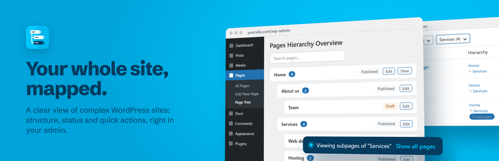

# Easy Hierarchy

Tree view for Pages & Custom Post Types: a visual hierarchy, a Hierarchy column and a parent filter in the WordPress admin.

[](https://wordpress.org/plugins/easy-hierarchy/)
[](https://wordpress.org/plugins/easy-hierarchy/)
[](https://wordpress.org/plugins/easy-hierarchy/)
[](https://wordpress.org/plugins/easy-hierarchy/)
[](https://wordpress.org/plugins/easy-hierarchy/#reviews)
[](https://www.gnu.org/licenses/gpl-2.0.html)



See and manage the structure of your site, page by page, for Pages and every hierarchical post type, without leaving the admin.

## Features

- **Tree view** for every hierarchical post type (for example **Pages → Page Tree**), with drafts, pending, private and scheduled items
- Search, status filter and sorting (title, newest, oldest, recently modified) that keep the hierarchy
- Publish date, last revision, status and Edit / View links for each item
- **Hierarchy column** in the list screen, with the full parent path and the number of children
- **Parent filter** with every item that has children, at any level
- **Settings → Easy Hierarchy**: all hierarchical post types, with links to their list and tree
- Fast on large sites: each screen loads the hierarchy with a single query

## Requirements

- WordPress 4.6+
- PHP 7.4+

## Installation

From the WordPress dashboard: **Plugins → Add New → search for "Easy Hierarchy"**.

After activation, open **Pages → Page Tree**, or **Settings → Easy Hierarchy** to see all supported post types.

## For developers

| Hook | Type | Description |
| --- | --- | --- |
| `easy_hierarchy_post_types` | Filter | Array of post type objects where Easy Hierarchy is active. By default, all hierarchical post types with an admin screen |

```php
// Hide Easy Hierarchy for a post type
add_filter('easy_hierarchy_post_types', function ($post_types) {
    unset($post_types['my_post_type']);
    return $post_types;
});
```

## Contributing

Issues and pull requests are welcome.

## Links

- [Plugin page on WordPress.org](https://wordpress.org/plugins/easy-hierarchy/)
- [Support forum](https://wordpress.org/support/plugin/easy-hierarchy/)
- [Changelog](readme.txt)

## Credits

Copyright © 2020-2026 **Marco Milesi**
[www.marcomilesi.com](https://www.marcomilesi.com)
